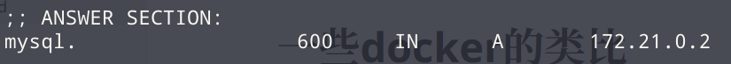

# docker的组成

- docker-daemon
  - 守护进程
- docker-cli
  - docker客户端
- docker-engine
  - 管理docker的容器的引擎

# 一些docker的类比

- docker镜像=类
- docker的容器=实体对象

# docker的常用命令

```bash
# 拉取镜像
docker pull <mirror_name>
# 后台运行镜像
docker run -dp <port1>:<port2> --name <container_name_customed> <mirror>
# 展示正在运行的container
docker ps
# 现实container的配置,常常用来查看ip地址，volume,以及挂在地址
docker inspect <container_name>
# 查看磁盘挂在关系
docker volumes inspect <volume_name>
# 提交镜像
docker commit -a <author_info> -m <commit message> -p <container_name_you_want_to_commit> <mirror_name_customed>
# 提交镜像的例子
docker commit -a "Tom" -m "docker mirror including jdk11 and tomcat" -p centos7 visualvk/tomcat_centos7
# 备份
docker save -o <path_you_want_to save> <mirror_name>
# 备份例子
docker save -o /tmp/mycentos_tomcat mycentos_comat
# 回复备份
docker load -i <path>
# 回复备份例子
docker load -i /tmp/mycentos_tomcat
```

# Dockerfile

**借助dockerfile可以快速创建容器**

- 前置要求
  - 关于此容器所需要的文件，例如环境报（java,tomcat），配置文件等需要再过同一个文件下
- 建议
  - 尽可以一个容器内所需要东西放在一个独立的文件夹中

**常用指令**

```shell
docker build -t <container_name_customed> <files_docker_needed>
# 例子
docker build -t mycentos_tomcat . # mycentos_tomcat依赖与`.`这个上下文背景
```

**dockerfile中的常用关键字(大小写不明感)**

- from：由某一镜像生成容器`From centos:7`
- run：运行指令`run mv test.txt mv_test.txt`
- label：标签，可以写上作者信息等`label "author"="Tom"`
- cmd：tty的命令执行`cmd ["source",".zshrc"]`
- entrypoint：与cmd类似`entrypoint ` ["source",".zshrc"]
- volume：新建卷（docker内），可以包含多个卷名`volume ["/mysql"]`
- expose：暴露端口`expose 8080`
- user：添加用户
- workdir：工作目录`workdir /app`
- add：添加文件到docker,可以是文件名，也可是地址，如果文件是压缩包，会自动解压`add apache-tomcat.tar.gz /usr/local/tomcat`
- copy：拷贝到docker`copy . .`
- env：环境变量`env JAVA_HOME=/usr/local/java`

[更多详情](https://docs.docker.com/engine/reference/builder/)

**一个dockerfile的例子**

- 目标：基于centos创建一个带有jdk11的tomcat镜像

- 步骤：

  - 在$HOME中创建/dockerfile文件
  - 创建dockerfile文件和tomcat文件
  - 编写dockerfile

  ```shell
  FROM centos
  RUN yum install -y open-java-jdk11.x86_64
  RUN mkdir /usr/local/tomcat
  ADD apache-tomcat-9.0.48.tar.gz /usr/local/tomcat
  ENV TOMCAT_HOME /usr/local/tomcat/apache-tomcat-9.0.48/
  ENV PATH $PATH:$TOMCAT_HOME/bin
  EXPOSE 8080
  CMD ["catalina.sh","run"]
  ```

  - 开始创建

  ```shell
  docker build -t mycentos_tomcat .
  ```

  - 运行镜像

  ```shell
  docker run -d mycentos_tomcat
  ```

# docker-compose

简化重复输入docker命令，实现依据yml配置文件，启动容器

docker-compose默认会将同一个配置文件中的服务连接到一个默认的网络(app_default)，这个网络并不是各个服务的IP地址

```bash
# 启动
docker-compose up -d
# 停止
docker-compose down [--volumes] # 一般不加volumes,因为重要数据在volumes中
# 跟踪部署情况
docker-compose logs -f app # app可以换成别的服务，例如mysql；也可以不输入，表示现实全部服务的信息
```

# network诊断工具

- nicolaka/networkshoot

  - 可以利用dig命令查询ip

  ```bash
  # 连接到目的网络
  docker run -it app_default nicolaka/networkshoot # -i：保证stdin打开 -t：tty
  # 查询mysql的ip
  dig mysql
  ```



