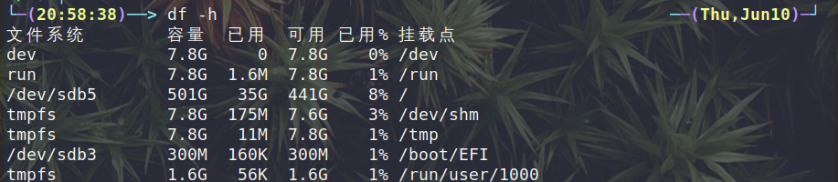

# 文件目录

- /bin：常用指令的存放地
- /sbin：super bin，意味着管理员才能使用的命令
- /home：普通用户的主目录
- /root：管理员的主目录
- /boot：启动linux所需要的核心文件
- proc：虚拟目录，是系统内存的映射
- /srv：service，存放服务启动后提取的数据
- /sys：文件系统
- /tmp：临时文件
- /media：自动识别出来的一些设备
- /mnt：挂载的地点
- /opt：给主机额外安装软件所摆放的目录
- /var：一般会放置日志文件
- /selinux：是一中安全的子系统，他能控制程序只能访问特定文件

# RWX

- R(read)=读

  - 对于文件夹来讲，表示可以删除、列出文件
  - 对于文件来讲，表示可以读取

- W(write)=写

  - 对于文件夹来讲，可以创建文件夹
  - 对于文件来讲，额可以写入

- X(excute)=执行

  - 对于文件夹来讲，可以进入目录

  - 对于文件来讲，可以执行文件分区&挂载&卸载

    查看硬盘或分区

    ```shell
    lsblk # 或者使用lsblk -f
    ```

    对硬盘分区

    ```shell
    cfdisk /dev/sdx # sdx中的x可以代表a,b,c,d
    ```

    挂载(**需要注意，命令行下的挂载重启后会失效，如果想永久生效，需要修改/etc/fstab中的映射关系**)

    ```shell
    # 需要先自己添加目录
    mkdir newdiskdir # 假设创建在/（根目录）下
    mount /dev/sda1 /newdiskdir
    ```

    卸载

    ```shell
    umount /dev/sda1 #递归卸载：umount -R /dev/sda1
    ```

    # 磁盘占用率

    ```shell
    df -h # 查看磁盘占用率，高于80%，需要清除空间，或是添加行硬盘
    ```

    

    ```shell
    # -h 带单位
    # -s 汇总
    # --max-depth=1 深度
    # -a 含文件
    # -c 明细
    du # 查询指定目录，不携带目录，表示查询当前目录
    # 例如使用以下指定
    du -hac --max-depth=1 /opt
    ```

    

    # 文件计数

    ```shell
    # 汇总/opt目录下所有文件加的数目
    ls -lR | grep "^-" | wc -l
    ```

    

    ```shell
    # 以树状图显示文件目录, 若没有tree，先安装tree
    # 以archlinux为例：sudo pacman -S tree
    tree /opt
    ```

