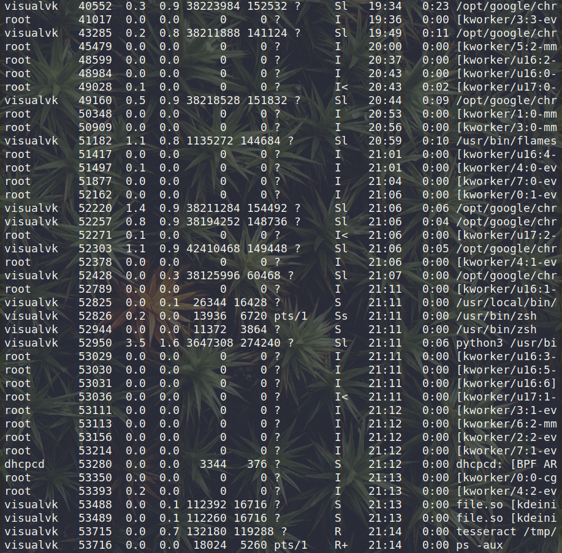
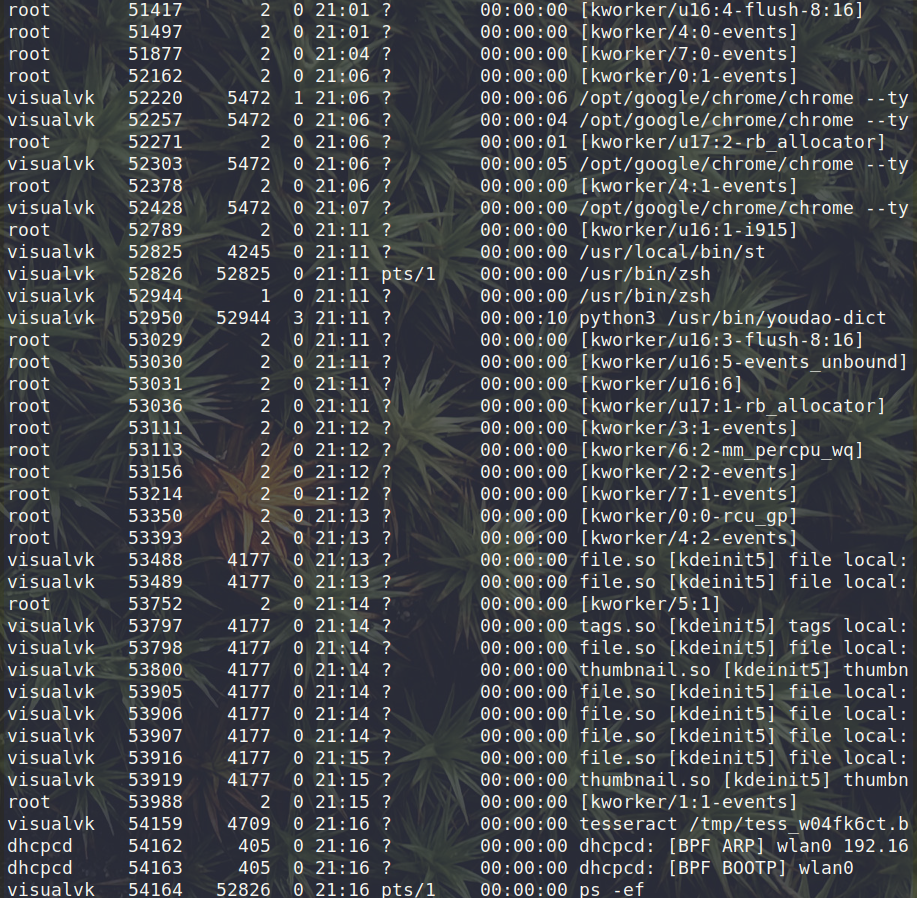
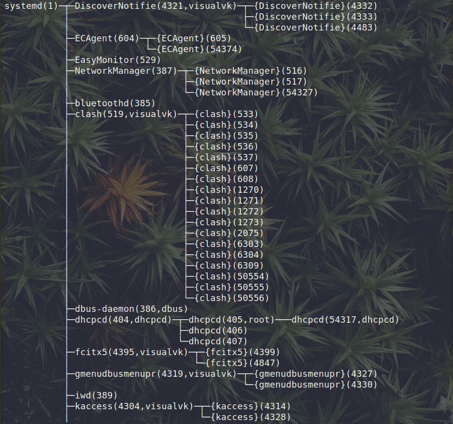

# 资源管理器

```shell
# -d <seconds> 多少秒刷新一次
# -i 不显示僵尸进程
# -p 指定监视的进程
top
# 交互操作，仅限进入top后
# P 以CPU排序
# M 以内存排序
# N 以PID排序
# u <username> 监视指定用户的进程
# k <PID> 终止指定进程，如果是需要强制终止，后续会有提示send pid xxx signal输入9强制终止
# q 退出
```


# 进程查看

```shell
ps -aux # 不显示父子关系
```

ps-a

| 表头    | 名称          | 参数解释                                                     |
| ------- | ------------- | ------------------------------------------------------------ |
| PID     | 进程编号      |                                                              |
| USER    | 用户名        |                                                              |
| %CPU    | 占用CPU       |                                                              |
| %MEM    | 占用内存      |                                                              |
| VSZ     | 占用虚拟内存  |                                                              |
| RSS     | 占用物理内存  |                                                              |
| TT      | 终端名        |                                                              |
| STAT    | 进程状态      | S=休眠 s=某个会话的先导进程 N=比普通进程优先级更低 R=运行 D=短时间等待 Z=僵尸进程 T=被追踪的进程 |
| TIME    | 在CPU中的时间 |                                                              |
| COMMAND | 使用的命令    |                                                              |

```shell
ps -ef # 显示进程之间的父子关系
```



# 终止进程

```shell
# 使用ps指定找出需要终止的进程
ps -aux | grep <what you want to match>
# 根据PID终止进程
kill <PID> # 如果需要强制终止加上-9: kill -9 <PID>
# 终止父进程同时，终止子进程
killall <name>
```

# 树状显示进程

```shell
# -u 显示用户名
# -p 显示进程号
pstree -up
```



