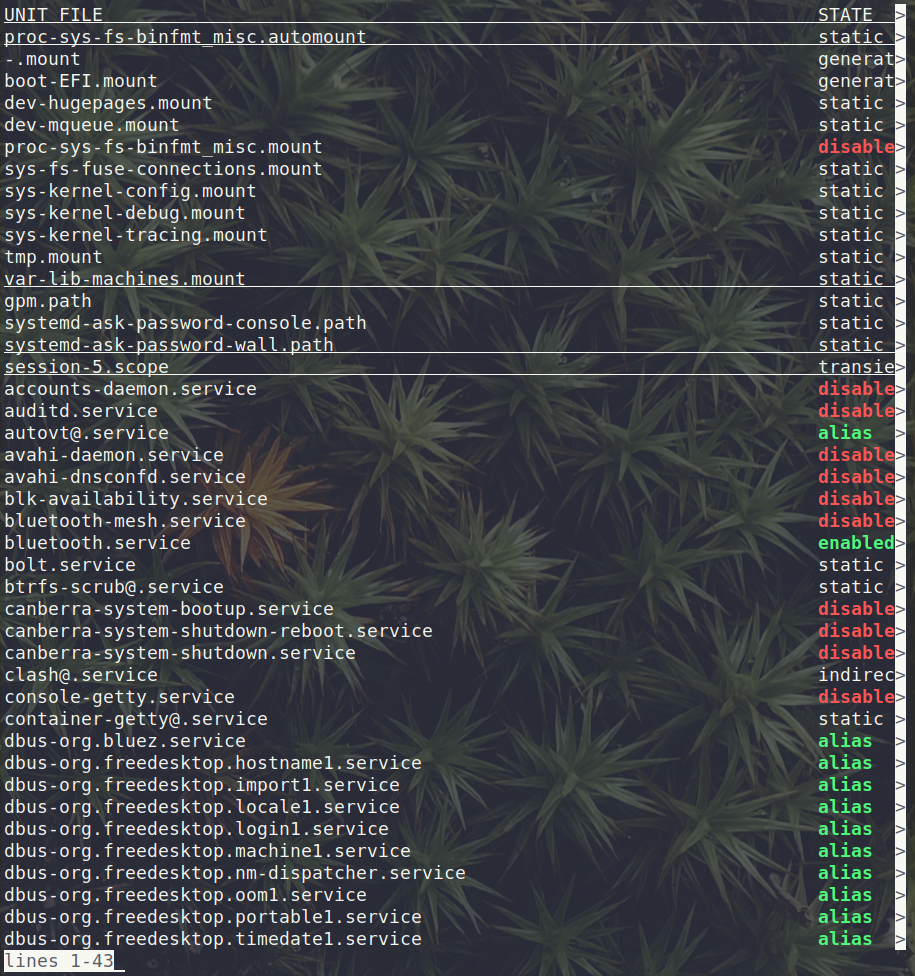
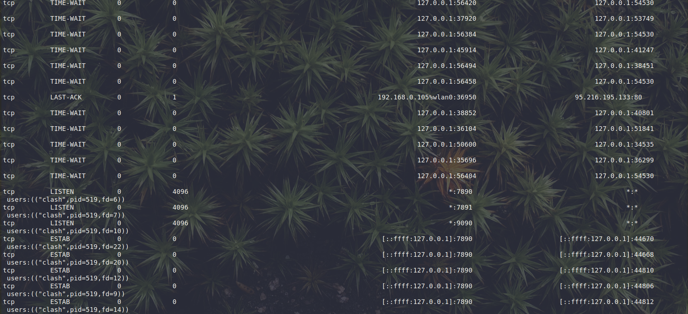
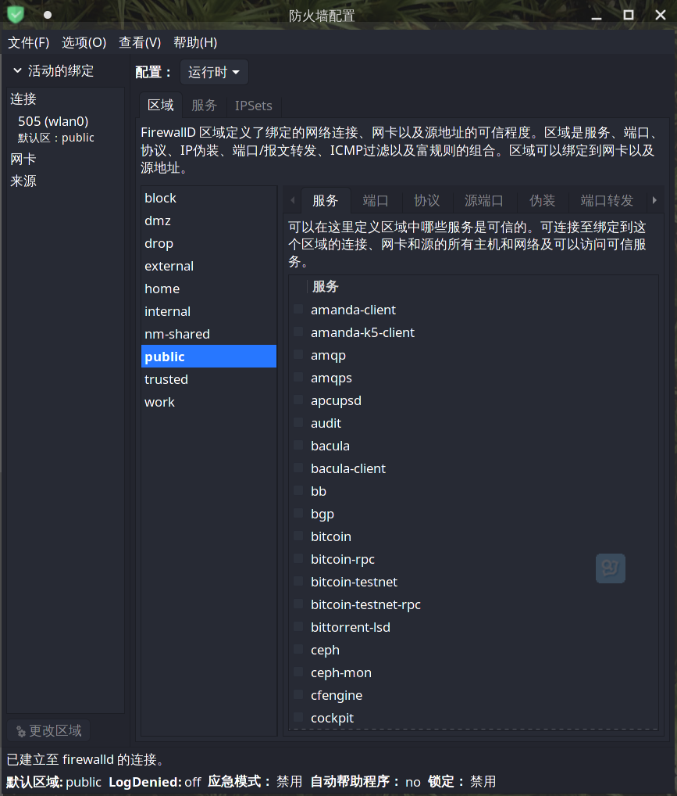

# 服务管理

```shell
# list-unit-files显示服务
# enable/disable开启启动/关闭
# status/start/stop/restart查看状态/开启/关闭/重启
systemctl list-unit-files
```



# 监控网络状态

```shell
# ss arch下默认，netstat centos下默认
ss -anp # 显示所有sockets进程，同时不解析域名
```



# 防火墙

## 指令方式管理

```shell
# --permnant 永久生效
# --add-port 添加过滤端口
# --remove-port 移除过滤端口
# --reload 重新加载
# --query-port 查询指定端口
# get-services 显示所有过滤服务
firewall-cmd --permnant --add-port <port>
```

## 界面管理

```shell
firewall-config
```



