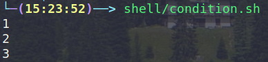

# Shell的一些规定

1. 必须指定shell的类型，常用的是bash
2. 赋予可执行权限(X)，或者使用sh进行运行

**Example**

```shell
nvim hello_world.sh
#===开始编写shell===
# !/bin/bash
echo "hello world"
#===wq退出保存======
chmod 755 hello_world.sh # 也可以不赋予X权限，但是需要使用sh <shell name>执行
./hello_world.sh
```

# Shell变量

## 变量命名以及赋值

```shell
# <variable>=<value> 普通变量
A=10
# readonly <variable>=<value> 静态变量
```

## 使用变量

```shell
# $<variable>
echo $A
```

## 释放变量（非静态）

```shell
#unset <variable>
unset A
```

## 先执行指令在赋值

```shell
A=`date` # 先执行date,然后将值赋值给A
A=${date} #同上
```

## 设置环境变量

```shell
# export <path variable>=<value>
export https_proxy=127.0.0.1:7890
# 若是需要写入/etc/profile等一起他类似文件的环境变量，需要重新家在环境变量配置文件：source <path>
source /etc/profile
```

**多行注释，并不是重点**

```shell
:<<!
A=`date`
!
```

# 获取参数

- `$<number> 指定位置参数`

- `$* 所有参数`

- `$@ 分割后的参数`

- `$# 参数个数`

- `$$ 获取当前程序PID`

- `$1 获取最后一个程序PID`
- `$- 使用Set命令设定的Flag一览`

- `$? 上一条执行结果，0是成功`

# 表达式

- `$(())`
- `$[]`
- `expr m + n`，这个要求数字与数字之间必须空格分割，并且*需要用\进行转义

# 条件判断

# 比较符号

- -lt：<
- -le：<=
- -eq：=
- -gt：>
- -ge：>=
- -ne：！=

## 文件判断

- -r：读权限
- -w：写权限
- -x：执行权限
- -f：文件存在&常规
- -e：文件存在
- -d：目录存在

## 流程控制

- if控制

```shell
if [ <condition> ]
then
	<code>
elif [ <condition> ]
then
	<code>
fi
```

- case控制

```shell
case <variable> in
<value>)
	<code>
;;
<value>)
	<code>
;; 
esac
```

**Example**

```shell
# condition.sh
#!/bin/bash
# hello_world existed ?
if [ -f ~/Documents/learn-linux/shell/hello_world.sh ]
then
    echo 1
fi
# "ok" == "ok" ?
if [ "ok" = "ok" ]
then
    echo 2
fi
# 23 <= 25 ?
if [ 23 -le 25 ]
then
    echo 3
fi
#==================
./condition.sh
```



- for循环

```shell
# for in结构
for <variable> in values
do
	<code>
done
# 普通for结构
for (( <variable> = <start>; <variable><=<end>;<variable>++))
do
	<code>
done
```

- while循环

```shell
while [ condition ]
do
	<code>
done
```

# 读取输入

read (option) (paramater)

option: 

- -p: 提示信息
-  -t：等待时间

```shell
# read -t <time> -p <string of hint> <variable>
read -t 10 -p "请输入数字:"NUM1
echo $NUM1
```

# 函数

- 系统函数：
  - basename
  - dirname
  - date
  - ls
  - ……
- 自定义函数

```shell
function <funname>()
{
	<code>
	[return int;] #可选
}
```

**Example**

```shell
function getSum()
{
	echo "sum=$1+$2"
}

getSum $1 $2
```

