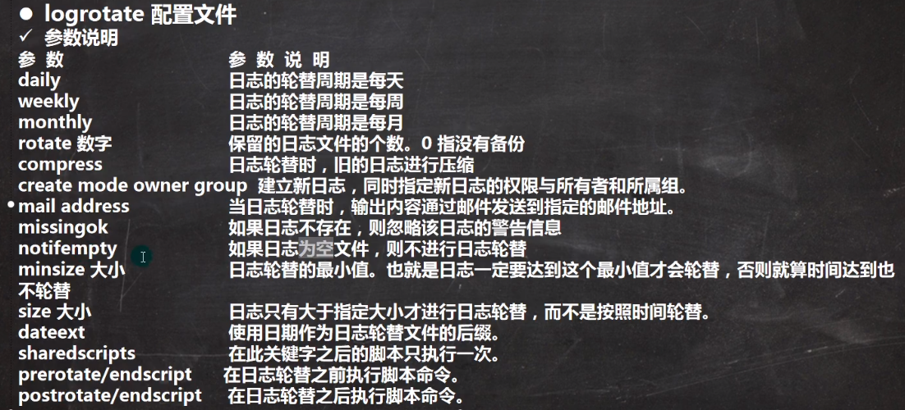

# syslogd

- 输出日志的格式：date+hostname+service+detail information
- 日志级别(级别依次递增)
  - debug
  - info
  - notice
  - warnning
  - err
  - crit
  - alert
  - emerg
  - none
- 日志设定
  - `<名称>.<日志级别> <输出日志>`
  - 例如：`local.* /var/log/local.log`，就表示local的所有类型的文件都输出到/var/log/local文件下

## logrotate

自动滚动log的名字，同时自动清除就得日志

一些logrotate.conf的配置参数说明



# journalctl

主要是内存日志

一些和journalctl相关的指令

```bash
journalctl -n 3 # 展示最近3条信息，3可以换成其他数字
journalctl -p err # 展示错误信息，err可以换成其他的日志级别
journalctl -since 19:00 -until 20:00 # 筛选出某一时间段的日志
journalctl -o verbose # 展示日志详细内容
journalctl | grep sshd # 结合grep查出与sshd相关的日志
```

